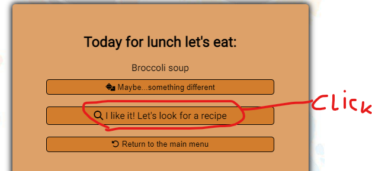
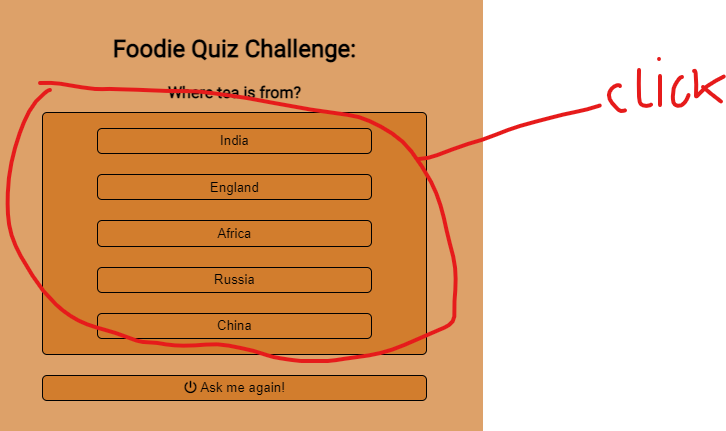
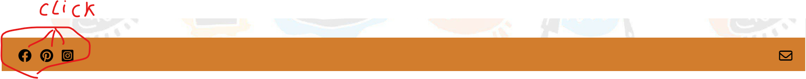
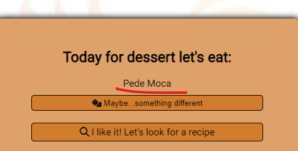

# what'sOnTheMenu
(Developer: Kamil Wojciechowski)

[Live webpage](https://wojtekkamilowski.github.io/CI_PP2_WOTM/)

## Table of Contents

1. [Project Goals](#project-goals)
    - [User Goals](#user-goals)
    - [Business Owner Goals](#business-owner-goals)
2. [User Experience](#user-experience)
    - [Target Audience](#target-audience)
    - [User Requirements and Expectations](#user-requirements-and-expectations)
    - [User Stories](#user-stories)
3. [Design](#design)
    - [Design Choices](#design-choices)
    - [Colors](#colors)
    - [Fonts](#fonts)
    - [Structure](#structure)
    - [Wireframes](#wireframes)
4. [Languages](#languages)
5. [Technologies Used](#technologies-used)
6. [Features](#features)
7. [Validation](#validation)
    - [HTML Validation](#HTML-validation)
    - [CSS Validation](#CSS-validation)
    - [JavaScript Validation](#javascript-validation)
    - [Accessibility](#accessibility)
    - [Performance](#performance)
    - [Device testing](#device-testing)
    - [Browser compatibility](#browser-compatibility)
    - [Testing user stories](#testing-user-stories)
 8. [Bugs](#Bugs)
 9. [Deployment](#deployment)
 10. [Credits](#credits)
 11. [Acknowledgements](#acknowledgements)

## Project Goals

### User Goals
- Find an idea what to eat for the chosen meal (breakfast/lunch/dinner/dessert).
- Easily run the dish lottery again in case the first drawn dish does not match the user's expectations.
- Look for recipes in case the user would like but does not know how to prepare / what is the drawn dish.
- Easily navigation throught the website.
- Entertainment with the quiz possibly while making the decision if the user would like to eat the drawn dish.
- Find social media of the website to find more content about food and network with other users with similar interests.
- Ask questions or provide feedback for the website owner by using the contact form. 

### Business Owner Goals
- Give users a random idea what to eat.
- Help users to search more about the drawn dish through the search engine.
- Entartain the user with the quiz to maximise the time spent on the website.
- Allow users to easily visit social media pages of the owner. 
- Collect feedback or answer questions from the users by using the contact form.

[Back to Table Of Contents](#table-of-contents)

## User Experience

### Target Audience
- People who like to eat and cook and looking for an inspiration.
- Users who would like to search more about food recipes and would like to have an idea for what dish they will search for.
- Users who might need some time to think if the drawn dish is a good idea for them, in the meantime entertain with the quiz.
- People who would like to network with other users with similar interests thorugh social media platforms.
- Users who would like to ask questions and provide feedback after using the website.

### User Requirements and Expectations
- Accessible and responsive website.
- Intuitive website with a layout allowing to easily navigate through it.
- Easy access to useful information.
- Links and features that function in accordance with their intended purpose. 
- Connection with the community on the social media platforms.
- A contact form to contact the website owner. 

[Back to Table Of Contents](#table-of-contents)

### User Stories

#### First-time User

As a first time user I want to:

1. Choose for which meal the dish is to be drawn. 
2. Easily run the lottery again if the first draw is not satisfactory.
3. Find recipes from different sources that matches my taste and/or cooking skills.
4. Easily navigate the website.
5. Be sure which for which meal the dish was drawn.
6. Be entertained with the quiz and check my subject related knowledge.
7. Easily access social media plaftorms of the website.

#### Returning User

As a returning user I want to:

8. Contact the website owner.
9. Find an idea what to eat for other meal.
10. Find some facts about food.

#### Business Owner 

As the owner I want to:

11. Give user an idea what to eat/cook for breakfast/lunch/dinner/dessert.
12. Allow users to reinitiate lottery.
13. Provide users with various options of the recipe for the drawn dish.
14. Allow users to easily navigate the website.
15. Entertain the users with the quiz to extend the time they spent on the website.
16. Link users with our social media pages.
17. Provide users with a feature to contact us.

[Back to Table Of Contents](#table-of-contents)

## Design

### Design Choices 
The main design choice was to create a simple website to help people answer the question: "What to eat today?". Inspire them to search for different variations of the recipes for the dishes that they might already eaten/ cooked. 
The logo is a simply fork and knife to inform the user that the website is food related.
The name: "what'sOnTheMenu" - is to present to the user to expect that the website is a contemporary place where they can built their own everyday food menu. 
Buttons were designed with simple icons to be intuitive. 
Quiz was designed to be easy to understand and bring some interesting facts about the subject.

[Back to Table Of Contents](#table-of-contents)

### Colors
The chosen colors were: black, orange (three different tones), green, red and blue. 
The colors were chosen to be simple and users to be familiar with the theme. 
Colors change when user hover mouse on clickable elements of the website.

Quiz colors change after choosing an answer:
- the quiz div background color changes to green if the user selected correct answer or to red if the answer was wrong.
- the correct answer background color changes to green and wrong answers background color changes to red. 

    
Colors contrasts

    

[Back to Table Of Contents](#table-of-contents)

### Fonts
The chosen font was Roboto found on Google Fonts and _Sans-serif_ was chosen as the fallback font.

[Back to Table Of Contents](#table-of-contents)

### Structure
The content of the website is placed in the center.
The logo and the name of the website is placed on the top, the main container in the middle and the footer placed on the bottom.
There are four icons in the footer: three with links to social media platforms and envelope linking to the contact page of the website.

The website consists of two pages:
- Home: the main container in the middle displays meals to be selected and dish lottery with the quiz after a meal was selected.
- Contact: the main container displays a contact form that changes after the submission.

[Back to Table Of Contents](#table-of-contents)

## Wireframes

    
Home

    
    
    
    
    
        

    
Contact

    
    
    

    
404

    
    
    

[Back to Table Of Contents](#table-of-contents)

## Languages
- HTML
- CSS
- JavaScript

## Technologies Used
- GitHub
- Gitpod
- Balsamiq - to create the wireframes.
- Font Awesome - to add icons.
- favicon.io - to create the favicon.
- Google Fonts to find and add Roboto font. 
- TinyPNG to compress the background image.
- HTML Color Codes to find the main orange color : #D27D2D
- Color Meanings to find the blue color: #002366
- WebAIM to check for contrasts and identify hex codes for other colors(tones of orange: #DDA169 & hover: #E9BF9B; green: #003300 & red: #5C0000) 
- YouTube to find video tutorials with Random From Array and Quiz App.

[Back to Table Of Contents](#table-of-contents)

## Features
On the website there are two pages.

    
Logo and website name
  
    It is included on all two pages and 404.  
    The logo includes an icon.br>
    The logo and the website name are clickable link to Home page which is a common feature on many websites so users expect it.  
    When the user hovers the mouse over the other pages links they change color informing the user that it is clickable.  
    Logo and website name are responsive, the font size reduces for smaller screens. 
    User stories covered: 4, 9, 14. 
        

 

    
Footer
 
    Appears on two pages and 404. 
    Contains social media and envelope icons.  
    The icons change color when users hover the mouse over them to indicate they can be clicked. 
    It is responsive icons move closer to each other, they reduce size for very small screens. 
    User stories covered: 4, 7, 8, 13, 14, 16, 17.
      

   
    
Meal selection buttons

    Placed in the center of the home page.  
    Constists of four meal buttons: brakfast, lunch, dinner & dessert. Clicking on them inititiate dish lottery screen with drwan dish and a quiz question.  
    The icons change color when users hover the mouse over them to indicate they can be clicked. 
    The feature is responsive. 
    User stories covered: 1, 4, 9, 11, 14.
       

    
Dish lottery

    Appears when the user selects one of the meals for which a dish is to be drawn.  
    It informs which meal the user chose and displays a random dish drawn from the relevant array.  
    There is a different dish button that allows the user to reinitiate the lottery without need of refreshing the page.  
    Below different dish button there is a recipe link allows user to search for recipes for the drawn dish.  
    Return to the main menu button allows the user to easily navigate to the meal selection buttons.  
    The feature is responsive, different dish button breaks the words to ensure the content fits inside on very small screens. 
    User stories covered: 2, 3, 4, 5, 9, 11, 12, 13.
     

    
Quiz
 
    Appears when the user selects one of the meals for which a dish is to be drawn below the dish lottery.  
    It asks the user a random food related question with a few possible answers from which only one of them is correct.  
    When the user chooses an answer then correct answer button changes the background-color to green and wrong answer buttons' background-color changes to red.  
    The background-color of the quiz changes to green if the user chooses the correct answer and to red if the user chooses one of the wrong answers.  
    There is "Ask me again!" button that restarts the quiz and draws a random question once again.  
    The feature is responsive. 
    User stories covered: 6, 10, 15.
        

    
Contact form

    Placed in the middle of the contact page which the user can access by clicking the envelope icon in the footer.  
    It requires from the user to fill out all fields before submitting the form.  
    Once the user presses the submit it changes its value to "Sending..." and when it is sent the form restarts, displays a thank you message for the user, and a box with the link to reload the contact page appears. 
    The feature is responsive. 
    User stories covered: 4, 8, 14, 17.
     
        

[Back to Table Of Contents](#table-of-contents)

## Validation

### HTML Validation
To validate HTML of the website the W3C Markup Validation Service was used. The results have no errors.

#### Home

#### Contact
There is one warning about the type attribute for the code that was taken from Email JS: https://www.emailjs.com/docs/tutorial/creating-contact-form/ 

#### 404

### CSS Validation
To validate style.css the W3C Jigsaw CSS Validation Service was used. There were no errors found.

[Back to Table Of Contents](#table-of-contents)

### JavaScript Validation
JSHint JS Validation Serviced was used to validate the Javascript code for the website with no errors found.

#### dish-lottery-quiz.js
The message about five undefined variables are defined on settings.js to keep files organised and facilitate updating arrays with dishes and quiz questions.

#### settings.js
The message about five unused variables relate to the similar message for dish-lottery-quiz.js

#### contact-form.js
There is a message relating the emailjs variable that was included in the emailjs tutorial: https://www.emailjs.com/docs/tutorial/creating-contact-form/ 

## Accessibility
Accessibility was tested using WAVE - Web Accessibility Evaluation Tool. All of the pages have no errors.

### Home

### Dish

### Contact

### 404

### Color contrasts

[Color contrasts](#colors)

[Back to Table Of Contents](#table-of-contents)

## Performance
The tool used to test the performance of the website was Google Lighthouse from Google Chrome Developer Tools.

### Home

#### Desktop

#### Mobile

### Contact

#### Desktop

#### Mobile

### 404

#### Desktop

#### Mobile

[Back to Table Of Contents](#table-of-contents)

## Device testing
List of devices used to test the website:
- HP Pavilion 14 
- Acer Nitro 5 without and with an external monitor (HP V22)
- Sony Xperia L2
- Motorola Moto G20

The website was also tested using Google Chrome Developer Tools, Toggle Device Toolbar simulating view from twenty-five listed devices, including popular amongst users iPad and iPhone 5.

## Browser compatibility
Following browsers were used to test the website:
- Google Chrome
- Mozilla Firefox
- Microsoft Edge

[Back to Table Of Contents](#table-of-contents)

## Testing user stories 

1. As a first time user I want to choose for which meal the dish is to be drawn.

| Feature | Action  | Expected Result | Actual Result |
| ------- | ------- | --------------- | ------------- |
| Meal selection buttons | From the main container in the middle of the home page select one of the meal buttons | Draws a random dish for the selected meal | Works as expected |

[Back to Table Of Contents](#table-of-contents)

2. As a first time user I want to easily run the lottery again if the first draw is not satisfactory.

| Feature | Action  | Expected Result | Actual Result |
| ------- | ------- | --------------- | ------------- |
| Dish lottery | After accessing the dish lottery screen by clicking on the chosen meal, click on the box "Maybe...something different"  | Draws a random dish again | Works as expected |

[Back to Table Of Contents](#table-of-contents)

3. As a first time user I want to find recipes from different sources that matches my taste and/or cooking skills.

| Feature | Action  | Expected Result | Actual Result |
| ------- | ------- | --------------- | ------------- |
| Dish lottery | After accessing the dish lottery screen by clicking on the chosen meal, click on the box "I like it! Let's look for a recipe"  | Opens google.com with search results: recipe+for+${dishName} | Works as expected |

[Back to Table Of Contents](#table-of-contents)

4. As a first time user I want to easily navigate the website.

| Feature | Action  | Expected Result | Actual Result |
| ------- | ------- | --------------- | ------------- |
|  Logo and website name | Click on the logo or website name | Brings the user to the home page | Works as expected |
| Meal selection buttons | From the main container in the middle of the home page select one of the meal buttons | Draws a random dish for the selected meal | Works as expected |
| Footer  | Click on the envelope icon to move to the contact page | Brings the user to the contact page with the contact form | Works as expected |
| Meal selection buttons | From the main container in the middle of the home page select one of the meal buttons | The dish lottery screen appears | Works as expected |
| Dish lottery | After accessing the dish lottery screen by clicking on the chosen meal, click on the box "Return to the main menu" | Brings the user to the home page | Works as expected |
| Contact form | Click on box "Return to the main menu" | Brings the user to the home page | Works as expected |

[Back to Table Of Contents](#table-of-contents)

5. As a first time user I want to be sure which for which meal the dish was drawn.

| Feature | Action  | Expected Result | Actual Result |
| ------- | ------- | --------------- | ------------- |
| Dish lottery | After accessing the dish lottery screen appears a message on the top: "Today for ${mealType} let's eat:" | User will see name of the meal that was selected from meal selection buttons | Works as expected |

[Back to Table Of Contents](#table-of-contents)

6. As a first time user I want to be entertained with the quiz and check my subject related knowledge.

| Feature | Action  | Expected Result | Actual Result |
| ------- | ------- | --------------- | ------------- |
|  Quiz | After accessing the dish lottery screen scroll down to see the quiz and select one of the answers | After selecting an answer the background color changes to green if the answer was correct of to red if it was wrong, the wrong answers background color changes to red and to green for the correct one | Works as expected |

[Back to Table Of Contents](#table-of-contents)

7. As a first time user I want to easily access social media plaftorms of the website.

| Feature | Action  | Expected Result | Actual Result |
| ------- | ------- | --------------- | ------------- |
| Footer  | Click on any of the social media icons to open in a new tab | Brings the user to the clicked social media platform | Works as expected |

[Back to Table Of Contents](#table-of-contents)

8. As a returning user I want to contact the website owner.

| Feature | Action  | Expected Result | Actual Result |
| ------- | ------- | --------------- | ------------- |
| Footer  | Click on the envelope icon to move to the contact page | Brings the user to the contact page with the contact form | Works as expected |
| Contact form | Access the contact page by clicking the envelope icon in the footer fill out the form and click send | Informs if there is a missing required input, inform that the form is being sent and displays a thank you message if the form was sent correctly | Works as expected |

[Back to Table Of Contents](#table-of-contents)

9. As a returning user I want to find an idea what to eat for other meal.

| Feature | Action  | Expected Result | Actual Result |
| ------- | ------- | --------------- | ------------- |
|  Logo and website name | Click on the logo or website name | Brings the user to the home page with meal selection buttons feature in the middle | Works as expected |
| Meal selection buttons | From the main container in the middle of the home page select one of the meal buttons | The dish lottery screen appears | Works as expected |
| Dish lottery | After accessing the dish lottery screen by clicking on the chosen meal, click on the box "Return to the main menu" | Brings the user to the home page with meal selection buttons feature in the middle | Works as expected |

[Back to Table Of Contents](#table-of-contents)

10. As a returning user I want to find some facts about food.

| Feature | Action  | Expected Result | Actual Result |
| ------- | ------- | --------------- | ------------- |
|  Quiz | After accessing the dish lottery screen scroll down to see the quiz and select one of the answers, click "Ask me again!" to try again | After selecting an answer the background color changes to green if the answer was correct of to red if it was wrong, the wrong answers background color changes to red and to green for the correct one, after clicking "Ask me again!" quiz restarts and draws a random question again | Works as expected |

[Back to Table Of Contents](#table-of-contents)

11. As the owner I want to give user an idea what to eat/cook for breakfast/lunch/dinner/dessert.

| Feature | Action  | Expected Result | Actual Result |
| ------- | ------- | --------------- | ------------- |
| Meal selection buttons | From the main container in the middle of the home page select one of the meal buttons | The dish lottery screen appears | Works as expected |
| Dish lottery | After accessing the dish lottery screen by clicking on the chosen meal, click on the box "I like it! Let's look for a recipe"  | Opens google.com with search results: recipe+for+${dishName} | Works as expected |

[Back to Table Of Contents](#table-of-contents)

12. As the owner I want to allow users to reinitiate lottery.

| Feature | Action  | Expected Result | Actual Result |
| ------- | ------- | --------------- | ------------- |
| Dish lottery | After accessing the dish lottery screen by clicking on the chosen meal, click on the box "Maybe...something different"  | Draws a random dish again | Works as expected |

[Back to Table Of Contents](#table-of-contents)

13. As the owner I want to provide users with various options of the recipe for the drawn dish.

| Feature | Action  | Expected Result | Actual Result |
| ------- | ------- | --------------- | ------------- |
| Meal selection buttons | From the main container in the middle of the home page select one of the meal buttons | The dish lottery screen appears | Works as expected |
| Dish lottery | After accessing the dish lottery screen by clicking on the chosen meal, click on the box "I like it! Let's look for a recipe"  | Opens google.com with search results: recipe+for+${dishName} | Works as expected |

[Back to Table Of Contents](#table-of-contents)

14. As the owner I want to allow users to easily navigate the website.

| Feature | Action  | Expected Result | Actual Result |
| ------- | ------- | --------------- | ------------- |
|  Logo and website name | Click on the logo or website name | Brings the user to the home page | Works as expected |
| Meal selection buttons | From the main container in the middle of the home page select one of the meal buttons | Draws a random dish for the selected meal | Works as expected |
| Footer  | Click on the envelope icon to move to the contact page | Brings the user to the contact page with the contact form | Works as expected |
| Meal selection buttons | From the main container in the middle of the home page select one of the meal buttons | The dish lottery screen appears | Works as expected |
| Dish lottery | After accessing the dish lottery screen by clicking on the chosen meal, click on the box "Return to the main menu" | Brings the user to the home page | Works as expected |
| Contact form | Click on box "Return to the main menu" | Brings the user to the home page | Works as expected |

[Back to Table Of Contents](#table-of-contents)

15. As the owner I want to entertain the users with the quiz to extend the time they spent on the website.

| Feature | Action  | Expected Result | Actual Result |
| ------- | ------- | --------------- | ------------- |
|  Quiz | After accessing the dish lottery screen scroll down to see the quiz and select one of the answers | After selecting an answer the background color changes to green if the answer was correct of to red if it was wrong, the wrong answers background color changes to red and to green for the correct one | Works as expected |
|  Quiz | After accessing the dish lottery screen scroll down to see the quiz and select one of the answers, click "Ask me again!" to try again | After selecting an answer the background color changes to green if the answer was correct of to red if it was wrong, the wrong answers background color changes to red and to green for the correct one, after clicking "Ask me again!" quiz restarts and draws a random question again | Works as expected |

[Back to Table Of Contents](#table-of-contents)

16. As the owner I want to link users with our social media pages.

| Feature | Action  | Expected Result | Actual Result |
| ------- | ------- | --------------- | ------------- |
| Footer  | Click on any of the social media icons to open in a new tab | Brings the user to the clicked social media platform | Works as expected |

[Back to Table Of Contents](#table-of-contents)

17. As the owner I want to provide users with a feature to contact us.

| Feature | Action  | Expected Result | Actual Result |
| ------- | ------- | --------------- | ------------- |
| Footer  | Click on the envelope icon to move to the contact page | Brings the user to the contact page with the contact form | Works as expected |
| Contact form | Access the contact page by clicking the envelope icon in the footer fill out the form and click send | Informs if there is a missing required input, inform that the form is being sent and displays a thank you message if the form was sent correctly | Works as expected |

[Back to Table Of Contents](#table-of-contents)

## Bugs
| Bug  | Fix  |
| ------- | ------- |
| Background image was not appearing behind the dish lottery after clicking on a meal button | Change css position propery to "fixed" |
| Low color contrast | Find tones of the chosen colors with a better contrast using WebAim Contrast Checker |
| The contact form was not restarting after the submission | Add .reset() function to emailjs.sendForm("service_bb9gt6r", "wotm-contact-form", this) .then(() => { |
| Quiz question does not appear | Add if statement: if (randomQuestions.length > currentQuestionIndex + 1) for the quiz code |

[Back to Table Of Contents](#table-of-contents)

## Deployment 
The website was deployed on GitHub Pages as per following steps:
1. From the GitHub repository open the settings tab.
2. Select Pages from the options on the left (Code and automation section).
3. Source: deploy from a branch.
4. Branch: main.
5. Once the page is reloaded there was a notification "Your site is live at https://wojtekkamilowski.github.io/CI_PP2_WOTM/index.html"

To fork the repository you should:

1. Open the repository: https://github.com/WojtekKamilowski/CI_PP2_WOTM
2. Select Fork from the options on the right.

To clone the GitHub repository you should:
1. Open the repository: https://github.com/WojtekKamilowski/CI_PP2_WOTM
2. In the Code tab select click on Code button and select the preferred option (HTTPS/SSH/Github CLI) and click the copy button on the right of URL
3. Open Git Bash and change the current working directory to the desired one.
6. Type git clone and paste the previously copied URL from GitHub then pressing the enter button should create a local clone.

[Back to Table Of Contents](#table-of-contents)

## Credits 

### Media

### Code

[Back to Table Of Contents](#table-of-contents)

## Acknowledgements
I would like to thank those who were a great support and inspiration during writing this project:
- My mentor Mo Shami.
- Code Institute for preparing the materials and providing a wide range of available means of learning for the students.
- My family who were the first users to test the website.
